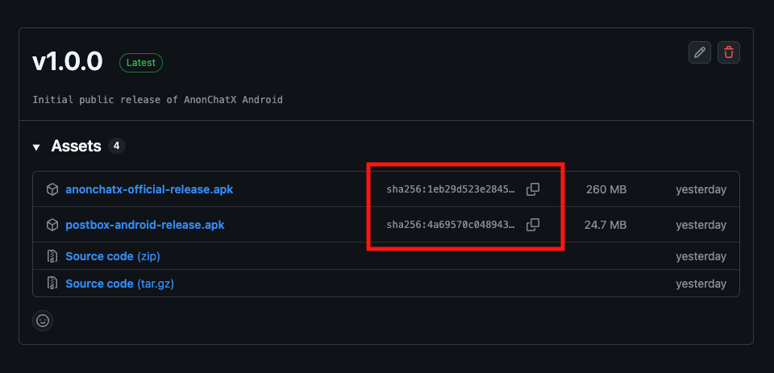

In high-risk environments, **how you install software matters as much as what software you install**.

Anonomi Messenger is distributed outside centralized app stores by design.  
That means **verification is your responsibility**.

This page explains *when verification is critical*, *what to verify*, and *how to do it safely* — including **step-by-step instructions on Android**.

---

## When verification matters most

Treat verification as **mandatory** if any of the following apply:

- You downloaded the app over a monitored or hostile network
- You received the APK from someone else
- You used offline distribution or removable media
- The device or network could be tampered with
- The app will be used in a sensitive or high-risk context

If none of these apply and you trust your environment, verification is still recommended — just less urgent.

---

## What you are verifying

Verification answers one question:

> **Is this file exactly the one the Anonomi Messenger project published?**

You are checking that:
- The file was not modified
- The file was not replaced
- The file was not corrupted in transit

Verification does **not**:
- Make a compromised device safe
- Protect against malware already on your phone
- Replace good operational security

---

## Official release sources

Only trust releases from **official Anonomi Messenger channels**.

Official releases are published with:
- Versioned APKs
- Cryptographic checksums (hashes)
- Optional signature information

Never trust:
- Random APK mirrors
- Repacked or “optimized” builds
- Files that cannot be independently verified

---

## Verification methods

### Method 1: Check the file hash (recommended)

This is the most reliable method.

**What you need**
- The downloaded APK
- The official checksum for that release (usually SHA-256)

**How it works**
- You calculate the hash of the APK
- You compare it with the published hash
- If they match exactly, the file is authentic

Even a single changed byte will result in a different hash.

---

## Step-by-step: Verify an APK hash on Android

Below are **practical ways to verify hashes directly on Android**, without needing a computer.

### Option A: Using a hash checker app (simplest)

This is the easiest method for most users.

**Recommended apps**
* **Hash Droid** — open source, available via F-Droid

  [https://f-droid.org/en/packages/com.hobbyone.HashDroid/](https://f-droid.org/en/packages/com.hobbyone.HashDroid/)

- *APK Analyzer* (advanced users)

(Any app that can compute **SHA-256** hashes is fine.)

**Steps**
1. Install a hash/checksum app from a trusted source
2. Open the app
3. Select the downloaded Anonomi Messenger APK
4. Choose **SHA-256** as the hash algorithm
5. Copy the resulting hash
6. Compare it to the **official SHA-256 checksum** for that release

**Result**
- ✅ Exact match → file is authentic
- ❌ Any difference → **do not install**

> Tip: Ignore formatting differences (uppercase/lowercase), but every character must match.

---

### Option B: Using a terminal emulator (more control)

This is useful if you already use terminal tools.

**Recommended app**
- *Termux* (from a trusted source)

**Steps**
1. Open the terminal app
2. Navigate to the directory containing the APK
3. Run: sha256sum anonomi-version.apk

4. Compare the output with the published checksum

If the values match exactly, the file is verified.

---

### Option C: Verify on a separate trusted device (high-risk cases)

If your phone itself might be compromised:

1. Transfer the APK to a **trusted secondary device**
2. Verify the hash there
3. Only then install on the target phone (offline if possible)

This reduces the risk of on-device tampering.

---

## Signature continuity (updates only)

Android enforces that:
- Updates must be signed with the same key as the original install

This means:
- If Android accepts an APK as an update
- The signing key matches the previous version

This helps detect replacement attacks during updates, but it is **not sufficient for first-time installs**.

---

## After installing

Once installation is complete:

1. **Disable “unknown apps” permission** for the installer
2. Remove leftover APK files if they are no longer needed
3. Avoid reusing the same APK across devices unless verified again

---

## Offline and shared installs

If you receive Anonomi Messenger via:
- Offline sharing
- SD card
- USB transfer

You should:
- Verify the file before installing
- Prefer files that were verified *before* being shared
- Treat shared media as sensitive

Offline distribution reduces **network risk**, not **integrity risk**.

---

## Common mistakes to avoid

- Verifying after installing
- Trusting filenames instead of hashes
- Downloading the APK and checksum from the same untrusted source
- Leaving sideload permissions enabled permanently

---

## Summary

- Verification protects against tampering, not bad decisions
- Hash checks are the gold standard
- Signature continuity helps with updates
- Verification matters most when the environment is hostile

When in doubt: **verify first, install second**.

---

## Related

- **[Installation](/docs/usage/installation)**
- **[Offline app distribution](/docs/features/distribution)**
- **[Threat model](/docs/security/threat-model)**
- **[Operational security basics](/docs/usage/opsec)**